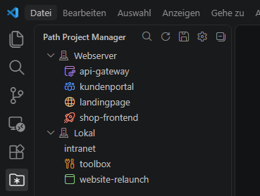

<p align="center">
  
</p>

<p align="center">
  <a href="https://marketplace.visualstudio.com/items?itemName=dipser.wildcard-project-manager">
    
  </a>
  <a href="https://open-vsx.org/extension/dipser/wildcard-project-manager">
    
  </a>
  <a href="LICENSE">
    
  </a>
  <a href="https://github.com/dipser/wildcard-project-manager/stargazers">
    
  </a>
  <a href="https://github.com/dipser/wildcard-project-manager/issues">
    
  </a>
</p>

# Wildcard Project Manager

[English](https://github.com/dipser/wildcard-project-manager/blob/develop/README.md) · **Deutsch**

Verwalte **Pfade mit Wildcards**. Praktisch, wenn in einem Pfad mehrere Projekte in Unterordnern liegen.

<p>
  
</p>

## Installation

[Download vom Visual Studio Marketplace](https://marketplace.visualstudio.com/items?itemName=dipser.wildcard-project-manager)<br>
[Download von Open VSX](https://open-vsx.org/extension/dipser/wildcard-project-manager)<br>
[Download aus dem Git-Repository](https://raw.githubusercontent.com/dipser/wildcard-project-manager/develop/releases/wildcard-project-manager-1.0.4.vsix)<br>
Ältere Versionen siehe [`releases/`](https://github.com/dipser/wildcard-project-manager/tree/develop/releases)

Manuelle Installation: In VS Code `Strg`+`Shift`+`P` drücken und "`Extensions: Install from VSIX...`" wählen. Danach erneut `Strg`+`Shift`+`P` und "`Developer: Reload Window`".


## Funktionsweise

Statt einzelne Projekte aufzulisten definierst du **Gruppen**. Jede Gruppe hat einen Namen und eine Liste von Pfaden. Ein Pfad, der auf `*` endet, wird als Verzeichnis eingelesen – jeder gefundene Unterordner wird automatisch zu einem Projekt in der Liste. Wildcards dürfen in jedem Segment stehen: `/var/www/*/*` läuft zwei Ebenen ab und legt die Treffer unter je einem Aufklapper pro übergeordnetem Ordner ab.

### JSON-Konfiguration `projects.json`

```json
[
  {
    "name": "Remote Server",
    "paths": ["vscode-remote://ssh-remote+externalserver/var/www/*"],
    "hidden": [],
    "order": 1
  },
  {
    "name": "Lokal",
    "paths": ["file:///home/user/projects/*"],
    "hidden": ["node_modules", ".old-*"],
    "order": 2,
    "collapsed": true,
    "settings": {
      "shop": { "icon-image": "rocket", "icon-color": "charts.red" }
    }
  }
]
```

| Feld | Beschreibung |
|---|---|
| `name` | Gruppenname in der Seitenleiste |
| `paths` | Liste von URIs oder nackten Pfaden. Ein `*` darf in jedem Segment stehen; alle passenden Unterordner werden als Projekte aufgelistet. Ohne Wildcard wird der Pfad selbst als einzelnes Projekt eingetragen. |
| `hidden` | Optional. Ordnernamen (auch mit `*`), die aus dem Scan-Ergebnis ausgeschlossen werden sollen. Bei mehrstufigen Mustern darf ein Eintrag **jede Ebene** meinen: `domain.com` blendet den ganzen Aufklapper aus, `domain.com/logs` genau einen Eintrag, und das kurze `logs` jeden so heißenden Ordner unter jeder Domain. |
| `order` | Optional. Umsortieren auch per Drag & Drop. |
| `collapsed` | Optional. Gruppe startet auf- oder zugeklappt. |
| `settings` | Optional. Einstellungen nach Ordnername (auch mit `*`): `icon-image` = [Codicon-ID](https://microsoft.github.io/vscode-codicons/dist/codicon.html), `icon-color` = [Theme-Farb-Id](https://code.visualstudio.com/api/references/theme-color). |

### Lokale und Remote Pfad-Angaben:

- `/var/www/*`
- `C:\Projekte\*`
- `file:///var/www/*`
- `vscode-remote://ssh-remote+<host>/…`
- `vscode-remote://wsl+…`
- `vscode-remote://dev-container+…`

### Wildcards

`*` steht für beliebig viele Zeichen und ist die einzige Wildcard. Sie überspringt nie eine Ebene, darf dafür aber in jedem Segment stehen – der Pfad wird dann Ebene für Ebene abgelaufen.

#### Mehrere Ebenen

Typisch für Plesk-Server, wo unter jeder Domain ihre Subdomains liegen:

```json
{ "name": "Server", "paths": ["/var/www/*/*"], "hidden": ["logs", "conf", "httpdocs", ".*"] }
```

```
▾ Server
  ▾ domain1.com
      sub1.domain1.com
      sub2.domain1.com
  ▸ domain2.com
```

- **Aufklapper**: jede Wildcard-Ebene außer der letzten. Ein Klick klappt nur auf und zu, das Verzeichnis öffnest du über das Kontextmenü. `Projekt ausblenden` darauf versteckt alles darunter.
- **Projektname**: alle Ebenen ab der ersten Wildcard (`domain1.com/sub1.domain1.com`) – der Schlüssel für `hidden` und `settings`, eindeutig auch wenn zwei Domains dieselbe Unterseite haben.
- **Feste Segmente** hinter einer Wildcard sind erlaubt: `/var/www/*/httpdocs` findet je Domain das Dokumentverzeichnis.
- **Unlesbare Ordner** werden übersprungen und am Ende der Gruppe als Hinweis gezählt.

### Cache `projects-cache.json`

Es wird ein **Cache** bei jedem fehlerfreien Ladevorgang aktualisiert.


### Features

- **Seitenleiste**: das Wildcard-Project-Manager-Icon in der Activity Bar.
- **Konfiguration**: Zahnrad-Icon in der View, oder `Wildcard Project Manager: Konfiguration bearbeiten`. Die Datei liegt im globalen Storage der Extension.
- **Öffnen**: Klick auf einen Eintrag, Rückfrage, dann im aktuellen Fenster.
- **Neues Fenster**: Kontextmenü oder Inline-Aktion, ohne Rückfrage.
- **Ausblenden**: Rechtsklick → `Projekt ausblenden`, die Meldung bietet `Rückgängig`.
- **Versteckte zeigen**: Auge-Symbol an der Gruppe; `Projekt einblenden` holt einen Eintrag wieder aus `hidden`.
- **Sortierung**: Gruppen per Drag & Drop, das schreibt `order` neu. Projekte ergeben sich aus den Mustern.
- **Zuklappen**: Rechtsklick auf eine Gruppe → `Gruppe standardmäßig zuklappen`, gespeichert als `collapsed`.
- **Icon**: Rechtsklick auf Projekt oder Ordner → `Icon` für [Farbe](https://code.visualstudio.com/api/references/theme-color) und [Codicon](https://microsoft.github.io/vscode-codicons/dist/codicon.html), gespeichert unter `settings`.
- **Suche**: Lupe in der View filtert Gruppen und Projekte nach Name oder Pfad.
- **Cache**: Ein nicht erreichbarer Pfad fällt auf `projects-cache.json` zurück, markiert mit `aus dem Cache`.
- **Aktualisieren**: Refresh-Icon, für anderswo angelegte Ordner. Die Konfiguration selbst wird beim Speichern neu geladen.


## Sprachen

Die Oberfläche richtet sich nach der Anzeigesprache von VS Code. Neben Englisch deckt sie alle vierzehn Sprachen ab, für die VS Code ein Language Pack anbietet:

- Chinesisch (vereinfacht)
- Chinesisch (traditionell)
- Deutsch
- Englisch (Standard)
- Französisch
- Italienisch
- Japanisch
- Koreanisch
- Polnisch
- Portugiesisch (Brasilien)
- Russisch
- Spanisch
- Tschechisch
- Türkisch
- Ungarisch

Diese Dokumentation liegt auf Englisch und Deutsch vor.


## Entwicklung

Build, Start im Extension Development Host, der Übersetzungs-Workflow und die Release-Schritte stehen in [CONTRIBUTING.md](https://github.com/dipser/wildcard-project-manager/blob/develop/CONTRIBUTING.md) (englisch).


## Lizenz

MIT
